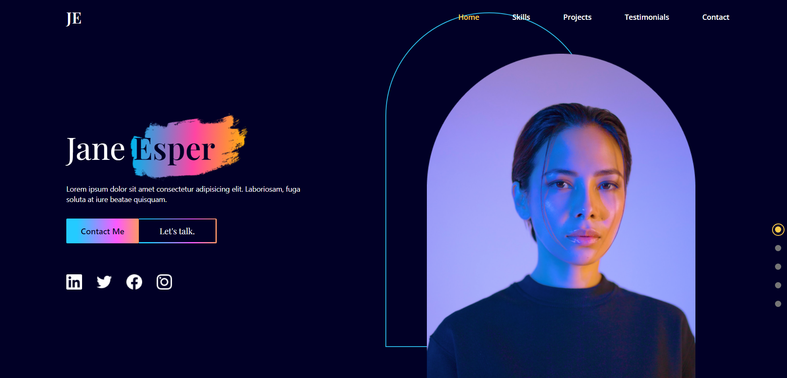
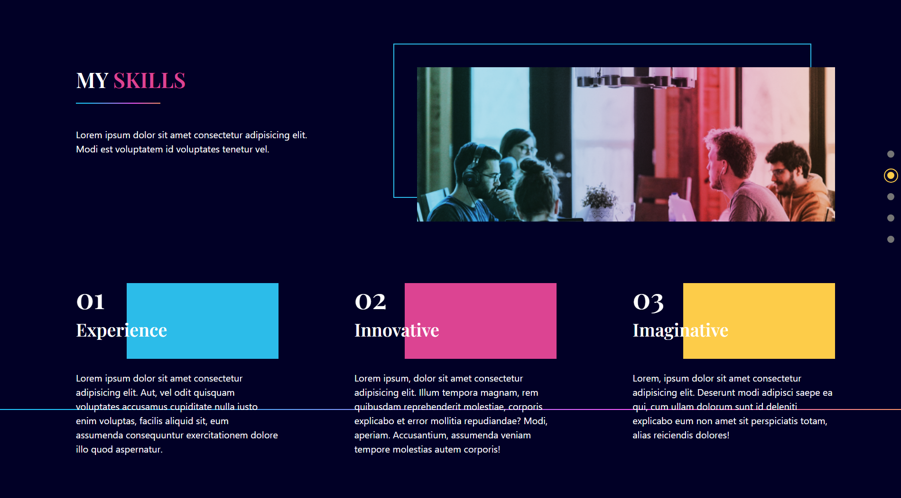
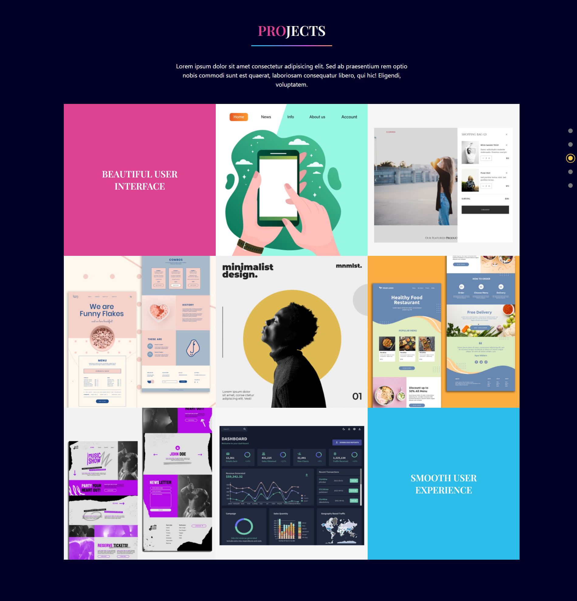
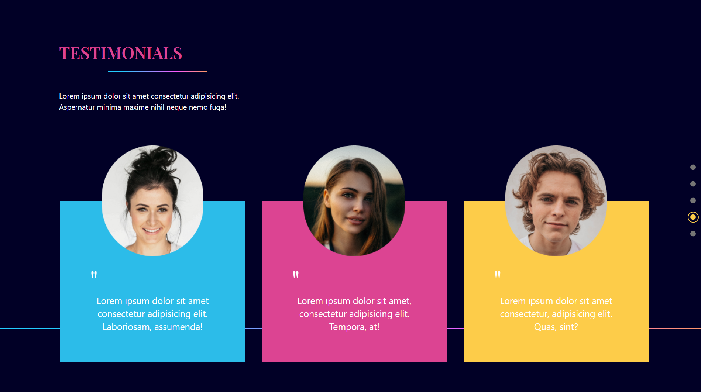
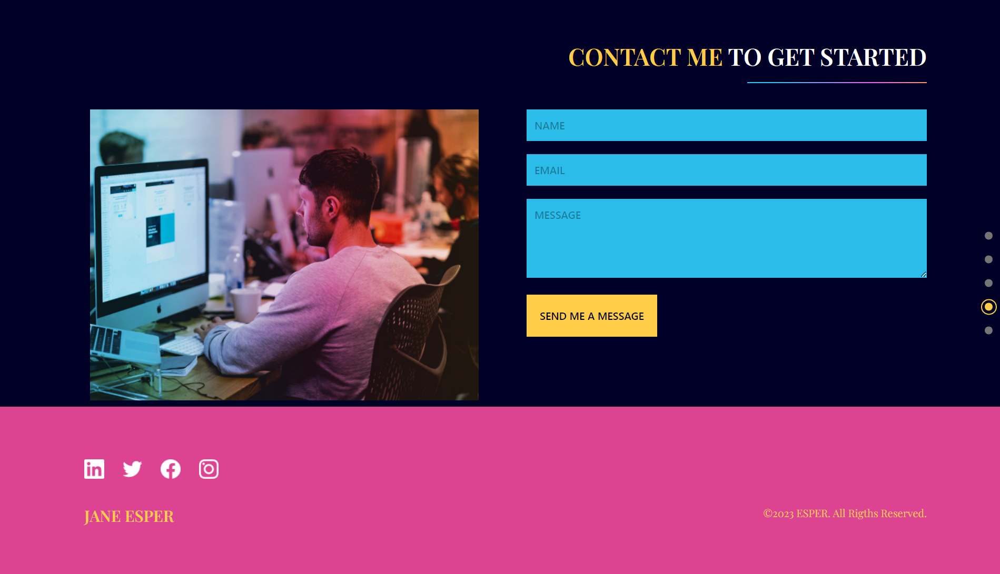

# Responsive React Portfolio Website
This design is inspired by this [video](https://youtu.be/JSJ8ftr92Vw), which belongs to [EdRoh](https://www.youtube.com/@EdRohDev).

## Technologies
This web page was made with the following technologies:
- HTML5
- CSS3
- JavaScript
- React
- React Hook Form
- React Anchor Link Smooth Scroll
- Framer Motion
- Tailwind CSS

## Pages
This project contains 7 pages: **Home**, **Skills**, **Projects**, **Testimonials** and **Contact**.

### Home
#### In this section you will see a title, a small description. The button to go to the contact section. You will see the social networks. And an image on the right side.

### Skills
#### In this section you will see a title and a short description. A small list of skills with their respective title and description.

### Projects
#### In this section you will see a title and a short description. Several completed projects, and if you hover over one of them, a description of the project will be displayed.

### Testimonials
#### In this section you will see a title and a short description. You will see the testimony of several people.

### Contact
#### In this section you will see a form where you can put your name, email and message you want to send. This form is not functional. And at the bottom is the footer.

